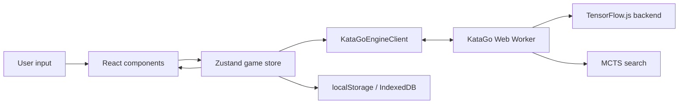

# Architecture

Easy Go is a single-page React app with a local analysis engine. The UI and
game state live on the main thread. KataGo model loading, neural network
inference, and MCTS run inside a dedicated Web Worker so the board remains
responsive during analysis.

## Runtime Overview

## Main Thread

The main thread owns the user experience:

- `src/main.tsx` mounts React.
- `src/App.tsx` is the top-level app component.
- `src/components/BattleApp.tsx` composes the game screen from focused pieces:
  `MatchCard` (win-rate bar), `BoardGrid` (stones, coordinates, hints,
  territory, hover preview, thinking scanline), `BattleActions` (move/pass/
  undo/score/recommendation controls), and the `dialogs/` (new game, B18 model
  download, score result).
- `src/hooks/` owns the screen's orchestration: `useModelManager` (model tiers,
  thinking times, B18 download), `useHintMode` (off/peek/always recommendations),
  `useScoreJudgment` (one-tap territory scoring), and `useDisplayWinRate`
  (smooth win-rate display across position changes).

The React components do not talk to the worker directly. They read state and
call actions from `useGameStore`.

## Game Store

`src/store/gameStore.ts` is the application core. It combines:

- The current board, player to move, captures, komi, and rules.
- A tree of `GameNode` objects, where each node owns its move, resulting
  `GameState`, SGF root properties, and optional analysis.
- Modes such as analysis, continuous analysis, and AI play.
- Settings, including model URL, TensorFlow.js backend preference, visits,
  thinking time, board size, rules, and hint visibility.
- Persistence for settings and uploaded model state.

Analysis results are attached to game-tree nodes so the current position keeps
its cached numbers when navigating back and forward.

The store file stays focused on the store definition. Supporting logic lives in
sibling modules:

- `src/store/settings.ts` — settings defaults, persistence, and migration.
- `src/store/gameTree.ts` — game-node construction, position keys, and SGF
  root-property helpers.
- `src/store/analysis.ts` — continuous-search scheduling, queue priorities,
  and AI-request epoch invalidation.
- `src/store/analysisActions.ts` — analysis-mode toggles, the continuous-search
  loop, MCTS analysis requests, and network-only quick evaluation.
- `src/store/aiPlayer.ts` — AI turn orchestration: thinking delay, waiting for
  candidate moves, playing the top move or passing, and scheduling.

## Engine Boundary

`src/engine/katago/client.ts` creates a singleton `Worker` for
`src/engine/katago/worker.ts`. The client exposes:

- `init`: load a model and backend before analysis.
- `analyze`: run MCTS and return move candidates, root values, policy, and
  ownership.
- `quickEval`: one network forward pass with no search, used for instant
  score judgment and for keeping the self-play win rate live with hints off.

The worker protocol is defined in `src/engine/katago/types.ts`. Messages are
plain serializable objects so they can cross the worker boundary with
`postMessage`.

Inside the worker, requests are serialized through a promise queue, and an
analyze request is aborted as stale as soon as a newer one has been posted.

## Analysis Queue

`src/utils/analysisQueue.ts` sits above the engine client on the main thread. It
adds:

- Priority ordering for interactive and AI-move jobs.
- Cancellation by group.
- Stale result detection.
- A bounded in-memory result cache.

The store uses this queue for continuous analysis and AI moves.

## Storage

Easy Go uses browser storage only:

- Settings are stored in `localStorage` under versioned keys.
- Downloaded model weights are cached in IndexedDB under
  `easy-go-model-cache` and verified by MD5 before reuse.

No server-side persistence exists.

## Project Invariants

- Supported board sizes are 5 through 19.
- Analysis values are stored from Black's perspective: `rootWinRate` is Black
  win probability and `rootScoreLead` is Black score lead.
- Worker messages must remain serializable.
- Model URLs are normalized before fetch so deployed base paths work.
- Do not bypass the store for game-tree mutation; UI should call store actions.
